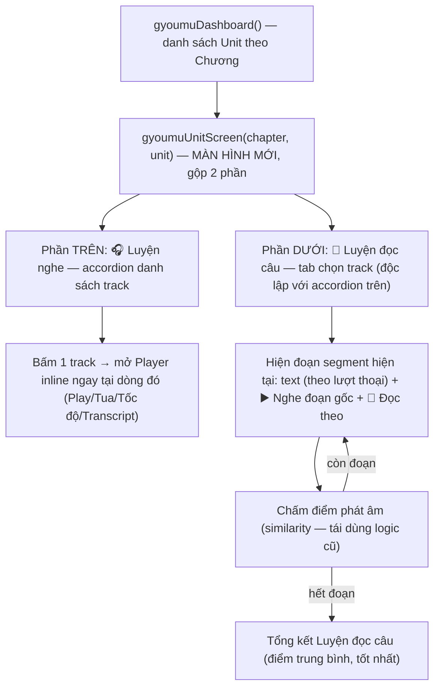

# FR_007 — IT業務編: Luyện đọc theo audio thật + Layout màn hình Unit gộp

> **Đã triển khai 2026-09-12 — BẢN RÚT GỌN, khác với thiết kế gốc dưới đây ở 1 điểm quan trọng:**
> Dữ liệu đã cắt sẵn (`segments_data.json` + 213 file mp3 + script `segment_reading_audio.py`, mục 3)
> **không có trong repo** khi bắt tay triển khai (tạo ở 1 session Cowork riêng, chưa từng commit).
> PM đã chọn phương án: **bỏ hẳn bước cắt audio theo lượt thoại**, giữ nguyên layout gộp 1 màn hình
> Unit (mục 4.2-4.4) nhưng phần "🎤 Luyện đọc câu" phát **nguyên file track thật** (nút "🎧 Nghe cả
> đoạn hội thoại") thay vì đoạn đã cắt riêng từng câu — mỗi câu vẫn có nút 🔊 nghe mẫu bằng TTS như
> cũ để luyện phát âm chính xác câu đó. Toàn bộ mục 3 (dữ liệu cắt sẵn) và thuật toán silence-detection
> ở mục 4.1/2b-#1 **không áp dụng** cho bản đã code — giữ lại trong file này chỉ để tham khảo nếu sau
> này muốn làm lại đúng bản gốc (cắt audio thật theo từng câu). Code: `gyoumuUnitScreen()` trong
> `app_template.html`, thay thế hoàn toàn `gyoumuTrackList()`/`gyoumuTrackDetail()`/`gyoumuReadingMode()`/
> `gyoumuReadingFinish()` cũ (đã xoá, không giữ dead code). Đã build + verify + test tay qua HTTP
> server cục bộ (accordion 1-mở-tại-1-lúc, tab đọc độc lập audio đang mở, hoàn thành lưu đúng
> `gyStore.read`, track không transcript vẫn nghe được nhưng ẩn khỏi tab đọc).
>
> ---
>
> Kế thừa toàn bộ dữ liệu đã tạo ở **FR_006** (mục 3 dưới đây, không đổi): 38 track AudioCD đã cắt
> thành đoạn ngắn bằng silence-detection, khớp transcript theo lượt thoại.
> FR_007 **thay thế mục 4.2 "Đề xuất tích hợp vào app" của FR_006** bằng layout cụ thể đã chốt lại
> với PM: gộp Luyện nghe + Luyện đọc câu vào **1 màn hình Unit duy nhất** (không còn 2 nút chọn
> chế độ TTS/audio thật như bản nháp FR_006 ban đầu — xem mục 4 để biết chi tiết + lý do).

---

## 0. 変更履歴 (Lịch sử thay đổi)

| Ngày | Nội dung | Người tạo |
|---|---|---|
| 2026-07-26 | Tạo FR_006: cắt thật 38 track AudioCD thành 5-7 đoạn/track (silence-detection), sinh `segments_data.json` + audio segment, đề xuất tích hợp (nháp ban đầu: 2 nút chọn TTS/audio thật) | NguyenNC (qua Claude, Cowork) |
| 2026-07-26 | FR_007: chốt lại layout sau khi hỏi PM 3 điểm mơ hồ — gộp 1 màn hình Unit (Luyện nghe trên + Luyện đọc câu dưới bằng audio thật, tab riêng theo track), thay thế hẳn mục 4.2 của FR_006 | NguyenNC (qua Claude, Cowork) |

## 1. Loại thay đổi

- [x] Thêm chức năng mới (Luyện đọc câu bằng audio thật)
- [x] Thay đổi UI/UX (gộp 2 màn hình Track List + Track Detail thành 1 màn hình Unit)
- [x] Sửa/nâng cấp chức năng có sẵn (thay thế `gyoumuReadingMode()` TTS của FR_004 làm entry point chính)

## 2. Tên chức năng

**Màn hình Unit gộp: Luyện nghe + Luyện đọc câu bằng audio thật** — module IT業務編, dựa trên 38 track AudioCD đã cắt sẵn thành đoạn ngắn (FR_006).

## 2b. Bối cảnh — 3 điểm đã hỏi lại PM và chốt phương án

| # | Câu hỏi | Phương án đã chốt |
|---|---|---|
| 1 | Luyện đọc câu dùng chế độ nào? | **Audio thật** (phát đúng đoạn mp3 đã cắt) — bỏ hẳn lựa chọn TTS cho phần này |
| 2 | 2 track/Unit (モデル会話 vs 聞き取り練習) nội dung hội thoại **khác nhau hoàn toàn** (đã verify thực tế bằng cách đọc transcript 4 track mẫu) → Luyện đọc câu lấy dữ liệu track nào? | **Có tab riêng** để chọn track luyện đọc — độc lập với việc đang phát/mở track nào ở phần Luyện nghe |
| 3 | Track Detail (Player) hiện là trang riêng — có giữ vậy không? | **Không** — gộp luôn Player vào ngay phần trên của màn hình Unit (inline/accordion), bỏ điều hướng sang trang riêng |

**Hệ quả:** nút "🎤 Luyện đọc câu" (TTS, `gyoumuReadingMode()` — FR_004) bị bỏ hoàn toàn khỏi UI, không còn entry point nào dẫn tới TTS reading. Hàm `gyoumuReadingMode()`/`gyoumuReadingFinish()` có thể giữ nguyên trong code (không gây hại, xem rủi ro #6).

## 3. Dữ liệu đã tạo sẵn (KHÔNG cần tạo lại, chỉ cần tích hợp)

### 3.1 Vị trí file

| File/Folder | Nội dung |
|---|---|
| `02_IT_Gyoumuhen/reading_segments/segments_data.json` | Manifest JSON — 38 track, mỗi track có mảng `segments` (đoạn audio + text tương ứng) |
| `02_IT_Gyoumuhen/reading_segments/audio/trackNN/trackNN_segNN.mp3` | 217 file mp3 đã cắt (36 track × 5-7 đoạn) |
| `02_IT_Gyoumuhen/reading_segments/audio/trackNN/trackNN_full.mp3` | Track 9, 21 (không có transcript — xem 3.4) giữ nguyên cả track, không cắt |
| `01_Build_App/_app_build/segment_reading_audio.py` | Script tạo ra toàn bộ dữ liệu trên — path tự suy từ vị trí file (giống `build_app.py`), chạy lại được nếu cần chỉnh thuật toán |

### 3.2 Thuật toán đã dùng (script `segment_reading_audio.py`)

1. Đọc transcript, tách mỗi track thành **units**: nếu track có ≥4 lượt thoại (dialogue nhiều nhân vật) → mỗi lượt thoại (`Tên：nội dung`) là 1 unit; nếu track chỉ có 1 lượt (độc thoại, VD track 1 quảng cáo DJ) → tách theo câu (`。！？`).
2. Số đoạn/track (K) theo độ dài: <65s → 5 đoạn · 65-95s → 6 đoạn · ≥95s → 7 đoạn.
3. Gom các unit liên tiếp thành K nhóm cân bằng theo **số ký tự** (không cắt giữa 1 lượt thoại — mỗi đoạn luôn là 1 hoặc nhiều lượt thoại/câu trọn vẹn).
4. Dùng `ffmpeg silencedetect` (ngưỡng -30dB, ≥0.25s) tìm các khoảng lặng tự nhiên trong audio → chọn điểm cắt gần nhất với ranh giới nhóm text (theo tỉ lệ ký tự tích lũy), sai lệch cho phép ±6s (hoặc ±15% độ dài track nếu ngắn hơn).
5. Cắt thật bằng `ffmpeg -ss/-to` (re-encode libmp3lame, không dùng stream copy để tránh lỗi khung ở điểm cắt).

### 3.3 Schema `segments_data.json` (rút gọn)

```jsonc
{
  "trackCount": 38,
  "tracks": [
    {
      "track": 2, "chapter": "Chương 1", "unit": "Unit 2",
      "unitJa": "電話で問い合わせる", "unitVi": "Gọi điện hỏi thông tin tuyển dụng",
      "contentType": "モデル会話 (Hội thoại mẫu)",
      "sourceAudioFile": "02 Track 2.mp3", "sourceDurationSec": 117.29,
      "transcriptAvailable": true, "segmentCount": 7,
      "segments": [
        {
          "id": "T02-S01", "order": 1,
          "startTime": 0.0, "endTime": 14.64, "durationSec": 14.64,
          "audioFile": "track02/track02_seg01.mp3",
          "speakers": ["リー","受付"],
          "text": "受付：はい、未来創造社でございます。\nリー：私、リーと申しますが……"
        }
        // ... đến seg07
      ]
    }
    // ... track 9, 21: transcriptAvailable=false, segmentCount=0, segments=[],
    //     có thêm field "gapNote" giải thích lý do (xem 3.4)
  ]
}
```

### 3.4 Track không có transcript (đã biết từ FR_004, giữ nguyên xử lý)

Track 9 và 21 (thiếu trang scan gốc — xem `gapNote` trong JSON) **không được cắt đoạn** (giữ nguyên `trackNN_full.mp3`, `transcriptAvailable:false`). Loại 2 track này khỏi danh sách chọn cho chế độ Luyện đọc audio thật, giống cách FR_004 mục 6.4 đã xử lý cho chế độ TTS.

## 4. Layout tổng thể (thay thế mục 4.2 cũ của FR_006)

### 4.1 `build_app.py` — cần thêm (giữ nguyên từ FR_006, không đổi)

- Hàm `extract_reading_segments()`: đọc `02_IT_Gyoumuhen/reading_segments/segments_data.json` (JSON có sẵn, không cần parse xlsx lại), trả về list track → inject biến JSON mới, VD `/*__READING_SEGMENTS__*/[]` → `READING_SEGMENTS_DATA`.
- Mở rộng `sync_audio()` (hoặc hàm riêng `sync_reading_segments_audio()`): copy `02_IT_Gyoumuhen/reading_segments/audio/` → `01_Build_App/audio/reading_segments/` (song song với cách `AudioCD/` → `audio/` hiện tại), để HTML tham chiếu đường dẫn tương đối `audio/reading_segments/trackNN/trackNN_segNN.mp3` giống pattern `audio/`+fname đang dùng ở dòng 1092 `app_template.html`.
- Verify sau build: check count `READING_SEGMENTS_DATA` = 38, check tổng số file mp3 copy sang = 217 + 2 (full).

### 4.2 Điều hướng (MỚI — thay thế luồng "2 nút chọn TTS/audio thật" của bản nháp FR_006)



`gyoumuTrackList()` và `gyoumuTrackDetail()` (hiện tại) → **gộp thành 1 hàm mới** `gyoumuUnitScreen(chapter, unit)`. Không còn điều hướng 2 bước (list → detail); tất cả nằm trên 1 `main.innerHTML`.

### 4.3 Wireframe (ASCII — tham khảo dựng lại trong FigJam nếu cần)

```
┌───────────────────────────────────────────┐
│ ←  Unit 2 · 電話で問い合わせる               │
│    Gọi điện hỏi thông tin tuyển dụng        │
├───────────────────────────────────────────┤
│ 🎧 LUYỆN NGHE                               │
│ ┌─────────────────────────────────────┐   │
│ │ 💬 Track 2 · モデル会話    ✅ Đã nghe  │ ▼ │  ← accordion header, bấm để mở/đóng
│ │   ▶️  ──●───────────  0:23 / 1:57      │   │
│ │   0.75x  [1x]  1.25x     ↺ Nghe lại   │   │
│ │   🔒 Hiện transcript                   │   │
│ │   (transcript panel nếu bấm hiện)      │   │
│ └─────────────────────────────────────┘   │
│ ┌─────────────────────────────────────┐   │
│ │ 🎧 Track 3 · 聞き取り練習              │ ▶ │  ← đang đóng
│ └─────────────────────────────────────┘   │
├───────────────────────────────────────────┤
│ 🎤 LUYỆN ĐỌC CÂU                            │
│  [ Track 2 ]  [ Track 3 ]     ← tab riêng   │
│                                              │
│   Đoạn 2 / 7                                │
│   受付：求人の件ですね。担当の者に代わります…    │
│   田口：お電話代わりました。人事部の田口です。  │
│                                              │
│   ▶️ Nghe đoạn gốc        🎤 Đọc theo        │
│   [ Đoạn tiếp theo → ]                       │
└───────────────────────────────────────────┘
```

### 4.4 Chi tiết hành vi

**Phần trên — 🎧 Luyện nghe**
- Danh sách track của Unit (1-2 track), dạng **accordion**: bấm vào 1 track → mở Player ngay tại dòng đó (không chuyển trang); bấm track khác → đóng player đang mở, mở player track mới (chỉ 1 player mở tại 1 thời điểm, tránh chồng audio).
- Nội dung Player inline = y hệt `gyoumuTrackDetail()` hiện tại: Play/Pause, seek bar + thời gian, 3 nút tốc độ, Nghe lại, toggle Hiện/Ẩn transcript. **Giữ nguyên, chỉ bỏ nút "🎤 Luyện đọc câu"** (theo mục 2b).
- Track không có transcript (9, 21) vẫn hiện trong danh sách này để nghe bình thường (giữ nguyên hành vi cũ), chỉ không xuất hiện ở tab phần dưới.
- Khi mở Player 1 track, phải dừng audio đang phát ở track khác (nếu có) và dừng TTS đang đọc (tái dùng `stopSpeech()` như code hiện tại).

**Phần dưới — 🎤 Luyện đọc câu (audio thật)**
- Tab chọn track: chỉ hiện các track có `transcriptAvailable=true` **và** có `segments` từ `segments_data.json` (loại track 9, 21 khỏi tab, giống FR_006 mục 3.4). Nếu Unit chỉ có 1 track hợp lệ → ẩn luôn thanh tab, hiện thẳng nội dung đọc.
- Mặc định chọn tab đầu tiên hợp lệ của Unit khi vào màn hình (độc lập với track nào đang mở ở phần Luyện nghe — đã chốt ở mục 2b câu 2).
- Nội dung mỗi đoạn: hiện `segment.text` (tách theo `\n`, tên nhân vật in đậm — tái dùng cách render transcript hiện có), nút "▶️ Nghe đoạn gốc" phát file `segment.audioFile` (KHÔNG dùng TTS), nút "🎤 Đọc theo" dùng lại nguyên `similarity()`/`setupMic()`/chấm điểm đã có trong `gyoumuReadingMode()`.
- Chuyển tab (đổi track) → dừng audio/mic đang chạy, reset về đoạn 1 của track mới.
- Hết các đoạn → màn tổng kết inline ngay trong phần dưới (không chuyển trang), có nút "Đọc lại" — tương tự `gyoumuReadingFinish()` nhưng render tại chỗ thay vì thay `main.innerHTML` toàn màn hình.
- Tái sử dụng tối đa: `similarity()`, `normJa()`, `playScoreSound()`, `setupMic()` — chỉ đổi nguồn phát mẫu từ `speak(l.t,...)` sang `new Audio('audio/reading_segments/'+seg.audioFile)`.

## 5. Ảnh hưởng đến file nào

- [x] `build_app.py` — thêm `extract_reading_segments()` + đồng bộ audio segment (không đổi so với FR_006)
- [x] `app_template.html`:
  - **Gộp lại**: `gyoumuTrackList()` + `gyoumuTrackDetail()` → hàm mới `gyoumuUnitScreen(chapter, unit)`
  - **Viết theo hướng "render fragment" thay vì "render toàn màn hình"**: logic Player và logic đọc-audio-thật cần tách thành hàm dựng HTML string + hàm gắn event riêng, để nhúng đồng thời 2 khối vào cùng 1 màn hình — xem rủi ro #1
  - **Bỏ nút "🎤 Luyện đọc câu" (TTS)** khỏi Player — không còn entry point gọi `gyoumuReadingMode()`
- [x] `.gitignore` — đã thêm dòng ignore `02_IT_Gyoumuhen/reading_segments/audio/` (audio derive được, ~37MB, không cần commit; `segments_data.json` vẫn track vì nhỏ và hữu ích để review)
- [ ] `PROJECT_日本語学習アプリ_Handover.md` — nên cập nhật kiến trúc (điều hướng IT業務編 đổi) sau khi code xong

## 6. Ràng buộc kỹ thuật

- Tại 1 thời điểm chỉ 1 nguồn audio phát (Player nghe HOẶC audio đoạn đọc HOẶC TTS còn sót — không chồng tiếng).
- Player (phần trên) và tab đọc (phần dưới) **độc lập trạng thái** — đổi tab đọc không ảnh hưởng accordion đang mở, và ngược lại.
- localStorage: kết quả Luyện đọc câu (audio thật) lưu riêng theo track, VD `gyStore.readAudio[track]` — không đụng `gyStore.read` cũ của TTS mode.
- Vẫn phải offline 100% — audio segment đã là file cục bộ, không cần mạng.
- Track 1 (độc thoại DJ quảng cáo, không có tên nhân vật rõ ràng) → mỗi đoạn hiện thuần văn bản, không có nhãn "🗣 Tên".
- Track không có transcript (9, 21): hiện ở phần Luyện nghe, ẩn khỏi tab phần Luyện đọc câu.

## 7. Rà soát: Điểm mơ hồ / Edge case / Rủi ro

| # | Nội dung | Mức độ | Đề xuất xử lý |
|---|---|---|---|
| 1 | **Đổi kiến trúc render**: code hiện tại theo mẫu "1 hàm = 1 màn hình, thay toàn bộ `main.innerHTML`" (`gyoumuTrackDetail()`, `gyoumuReadingMode()` đều vậy). Yêu cầu mới cần 2 khối UI sống đồng thời trên 1 màn hình (accordion nghe + tab đọc), mỗi khối có state/event riêng → phức tạp hơn 1 FR bình thường, không thể "copy-paste" nguyên hàm cũ. | **Cao** | Khi code, tách rõ: hàm dựng HTML (string) + hàm gắn sự kiện (bind), gọi cả 2 cho từng khối trong `gyoumuUnitScreen()`; ước lượng effort cao hơn dự kiến ban đầu ở FR_006 |
| 2 | **Ranh giới cắt audio là ước lượng** (kế thừa từ FR_006). Đã verify tự động (so RMS 0.3s quanh 41 điểm nối, mẫu 8 track ngẫu nhiên, đối chiếu trực tiếp trên file mp3 đã cắt): **35/41 (~85%) rơi rõ vào khoảng lặng**; **6/41 (~15%) ở vùng biên/không rõ ràng yên lặng**. Chưa nghe bằng tai thật để xác nhận cảm giác nghe. | **Cao** | Trước khi tích hợp UI: nghe thử ít nhất 6 track có điểm nối "CHECK" (track 11, 28, 4, 5, 19); nếu cụt, hạ ngưỡng `silencedetect` xuống `-25dB` hoặc tăng dung sai snap rồi chạy lại `segment_reading_audio.py` |
| 3 | Unit chỉ có 1 track (VD Unit 1/Chương 1, độc thoại DJ, không cặp với track khác) → phần Luyện nghe chỉ 1 dòng accordion, phần Luyện đọc câu chỉ 1 tab | Thấp | Ẩn thanh tab khi chỉ có 1 track hợp lệ, hiện thẳng nội dung đọc của track đó (đã ghi trong mục 4.4) |
| 4 | Track 9, 21 không có transcript → không dùng được cho Luyện đọc câu (giữ nguyên hạn chế từ FR_004) | Trung bình | Đã xử lý: loại khỏi tab đọc, vẫn hiện ở phần Luyện nghe để nghe thô |
| 5 | Khi mở accordion Player 1 track trong lúc đang phát audio đoạn đọc (phần dưới) hoặc ngược lại — cần dừng nguồn phát cũ để tránh 2 audio chồng nhau. Code hiện tại dùng 1 biến audio toàn cục cho Player (`currentGyoumuAudio`), nhưng audio đoạn đọc là audio element khác | Trung bình | Viết 1 hàm dùng chung `stopAllGyoumuAudio()` gọi trước mọi lần phát (Player, audio đoạn, TTS còn sót) thay vì quản lý rời rạc như hiện tại |
| 6 | Hàm `gyoumuReadingMode()`/`gyoumuReadingFinish()` (TTS, FR_004) không còn entry point sau FR_007 — code chết nhưng không lỗi | Thấp | Mặc định: giữ lại trong code (dễ revert nếu cần dùng lại); chỉ xóa hẳn khi PM yêu cầu rõ ở FR sau |
| 7 | Kích thước: +37MB audio segment đội thêm dung lượng build (song song với audio/ hiện có ~69MB) → tổng ~106MB audio khi build APK | Thấp | Chấp nhận được (offline, không base64 vào HTML) |
| 8 | Thuật toán số đoạn (5/6/7 theo ngưỡng 65s/95s) do Claude chọn dựa trên phân bố thực tế 38 track — chưa phải yêu cầu cứng của PM | Thấp | Có thể chỉnh hằng số trong `num_segments_for()` và chạy lại script nếu cần |

## 8. Ưu tiên

- [x] Cao — thay thế hẳn phần điều hướng ở FR_006 mục 4.2, cần chốt trước khi code

## 9. Ghi chú thêm — thứ tự triển khai đề xuất

1. **Nghe kiểm tra thủ công** ~10-15 đoạn ngẫu nhiên trong `02_IT_Gyoumuhen/reading_segments/audio/` (rủi ro #2), ưu tiên các điểm nối "CHECK" đã liệt kê.
2. `build_app.py`: viết `extract_reading_segments()` + đồng bộ audio → inject `READING_SEGMENTS_DATA` (nếu chưa làm).
3. Viết khối "Luyện nghe" (accordion, tái dùng nội dung `gyoumuTrackDetail()` cũ nhưng bỏ nút TTS reading) trước, verify chạy độc lập.
4. Viết khối "Luyện đọc câu" (tab + audio thật) — verify chạy độc lập.
5. Ghép 2 khối vào 1 `gyoumuUnitScreen()`, xử lý rủi ro #1 và #5 (dừng audio chồng chéo).
6. Xóa lời gọi `gyoumuTrackList()`/`gyoumuTrackDetail()` khỏi `gyoumuDashboard()`, trỏ sang `gyoumuUnitScreen()`.
7. Build & test thật: bấm thử accordion nhiều track, chuyển tab đọc, nghe đoạn audio thật, chấm điểm mic, kiểm tra không chồng tiếng khi thao tác nhanh.
